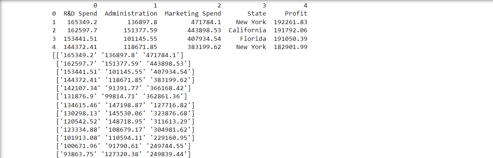
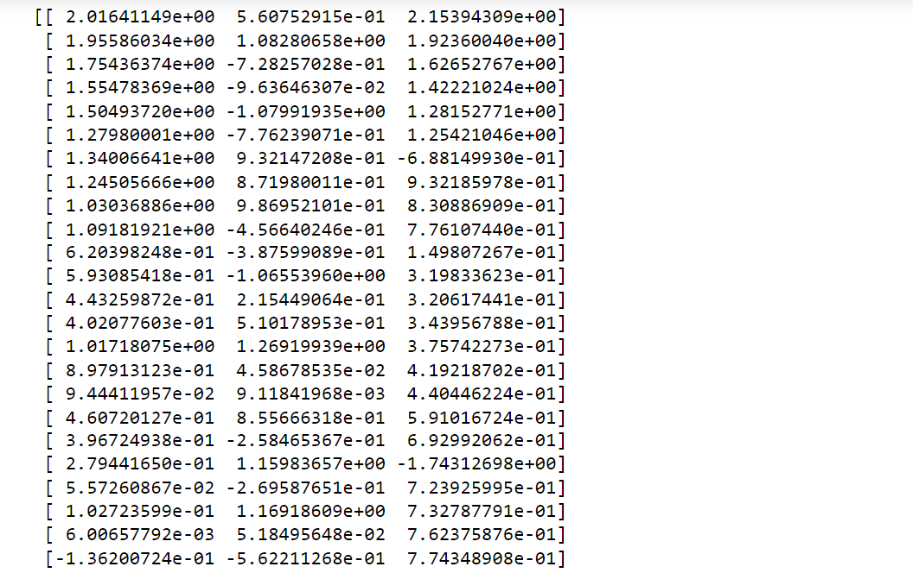
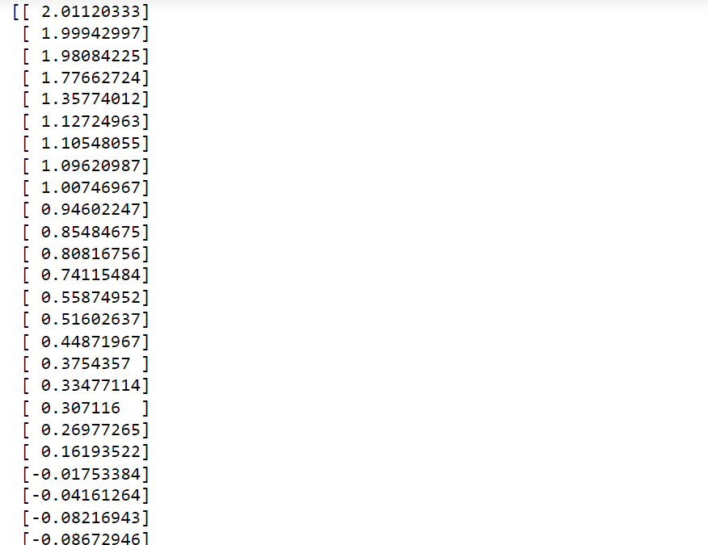
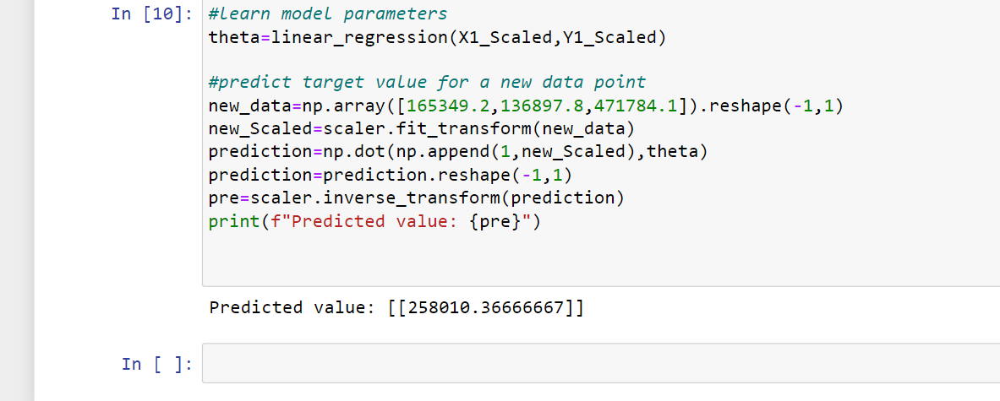

# Implementation-of-Linear-Regression-Using-Gradient-Descent

## AIM:
To write a program to predict the profit of a city using the linear regression model with gradient descent.

## Equipments Required:
1. Hardware – PCs
2. Anaconda – Python 3.7 Installation / Jupyter notebook

## Algorithm
```
1.Add a column to x for the intercept,initialize the theta
2.Perform graadient descent
3.Read the csv file
4.Assuming the last column is ur target variable 'y' and the preceeding column
5.Learn model parameters
6.Predict target value for a new data point

```

## Program:
```
/*
Program to implement the linear regression using gradient descent.
Developed by: GUTTHA KEERTHANA
RegisterNumber:  212223240045

Program to implement the linear regression using gradient descent.
Developed by: Jeshwanth Kumar
RegisterNumber: 212223240114
import numpy as np
import pandas as pd
from sklearn.preprocessing import StandardScaler
def linear_regression(X1,y,learning_rate=0.01,num_iters=1000):
    #add a column to  x for the interccept
    X=np.c_[np.ones(len(X1)),X1]
    
    #initialize trhe Theeta
    theta=np.zeros(X.shape[1]).reshape(-1,1)
    
    #perform gradient descent
    for _ in range(num_iters):
        predictions=(X).dot(theta).reshape(-1,1)
        
        #calculate errors
        errors=(predictions-y).reshape(-1,1)
        
        #uptade theta using gradient descent
        theta_=learning_rate*(1/len(X1))*X.T.dot(errors)
        pass
    return theta
data=pd.read_csv('50_Startups.csv',header=None)
print(data.head())

#assuming the last column is ur target variable 'y' and the preceeding column
X=(data.iloc[1:, :-2].values)
print(X)
X1=X.astype(float)
scaler=StandardScaler()
y=(data.iloc[1:,-1].values).reshape(-1,1)
print(y)
X1_Scaled=scaler.fit_transform(X1)
Y1_Scaled=scaler.fit_transform(y)
print(X1_Scaled)
print(Y1_Scaled)

#learn model parameters
theta=linear_regression(X1_Scaled,Y1_Scaled)

#predict target value for a new data point
new_data=np.array([165349.2,136897.8,471784.1]).reshape(-1,1)
new_Scaled=scaler.fit_transform(new_data)
prediction=np.dot(np.append(1,new_Scaled),theta)
prediction=prediction.reshape(-1,1)
pre=scaler.inverse_transform(prediction)
print(f"Predicted value: {pre}")

        


*/
```

## Output:

X & Y VALUES



X-SCALED & Y-SCALED





PREDICTED VALUE



## Result:
Thus the program to implement the linear regression using gradient descent is written and verified using python programming.
